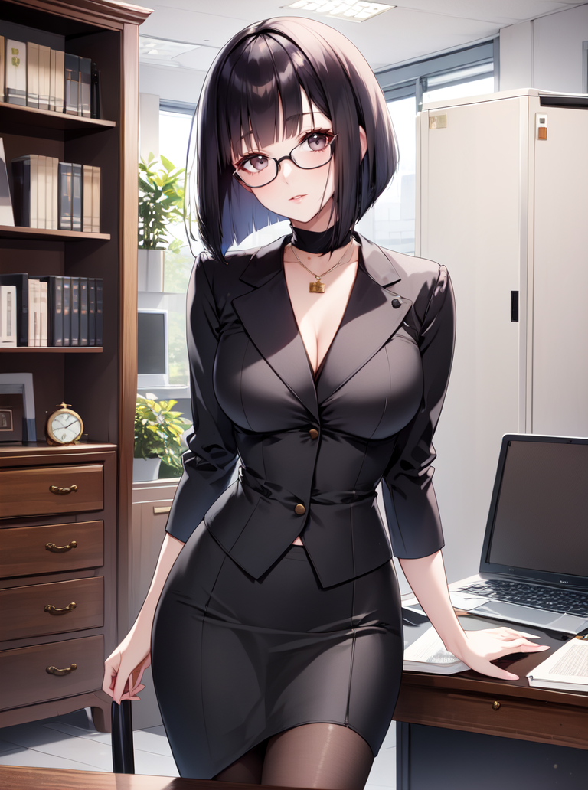
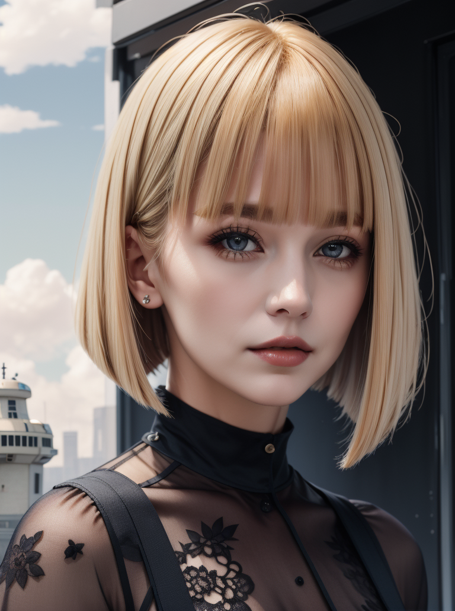

# LoRA - Sliced Bob Hairstyle

Open-sourced LoRA configuration and training data for Stable Diffusion 1.5.

| `f3e-1.0`                       | `dreamshaper_8`                              |
|---------------------------------|----------------------------------------------|
|  |  |

_Who was Bob anyway?_

A model for producing variations of the bob hairstyle with blunted bangs and a very sharp cut around the shoulders.

https://civitai.com/models/120969/sliced-bob-hairstyle

## Parameters

Recommended weight: `0.6-0.8`

Activation tags: `sliced bob`

Secondary tags:
* `<color> hair`
* `big hair` for more volume
* `[short|medium|long] hair` to a degree.

## Version History

| `XYZ0`                | `XYZ1`                |
|-----------------------|-----------------------|
|  |  |

#### v1.0

* Release

#### v2.0

* Less overfitting on hair color
* Less overfitting on grey backgrounds
* Fixed some blocky artifacts that could appear in the hair
* Fixed the overall shape; Less doubled edges and gaps.
* New base model - [f3e - Forge](https://civitai.com/models/160315)
* Added regularization images from [reg-f3e-1girl](https://github.com/n15g/reg-f3e-1girl)
* Removed unnecessary UNet blocks

## Training

* Load config into [Kohya SS](https://github.com/bmaltais/kohya_ss)
* Download a base model. I use a custom mix that I created called [f3e - Forge](https://civitai.com/models/160315)
* Download or create regularization images for the chosen model.
  For Forge use [reg-f3e-1girl](https://github.com/n15g/reg-f3e-1girl).
* Update paths for the model, image, output and logging folders
* Adjust the batch size for your GPU

| VRAM       | 24 GiB | 12 GiB | 8GiB |
|------------|--------|--------|------|
| Batch Size | 10     | 4      | 2-3  |
