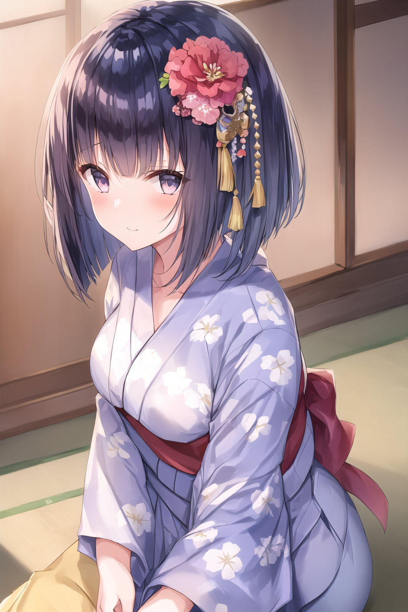
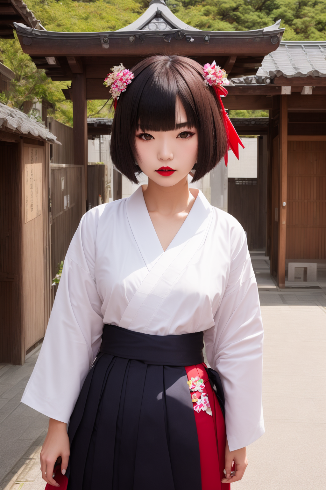

# LoRA - Sliced Bob Hairstyle

Open-sourced LoRA configuration and training data for Stable Diffusion 1.5.

| `AnythingV5V3_v5PrtRE`          | `deliberate_v2`                 |
|--------------------|---------------------------|
|  |  |

_Who was Bob anyway?_

A model for producing variations of the bob hairstyle with blunted bangs and a very sharp cut around the shoulders.

https://civitai.com/models/120969/sliced-bob-hairstyle

## Parameters

Recommended weight: `0.8`

Activation tags: `sliced bob`

Secondary tags: Hair length and color should work.

## Version History

#### v1.0

* Release

## Training

* Load config into [Kohya SS](https://github.com/bmaltais/kohya_ss)
* Download a base model. I use a custom mix that I created called [f3e - Forge](https://civitai.com/models/160315)
* Update paths for the model, image, output and logging folders
* Adjust the batch size for your GPU

| VRAM       | 24 GiB | 12 GiB | 8GiB |
|------------|--------|--------|------|
| Batch Size | 10     | 4      | 2-3  |
